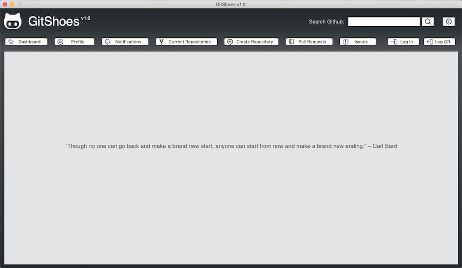
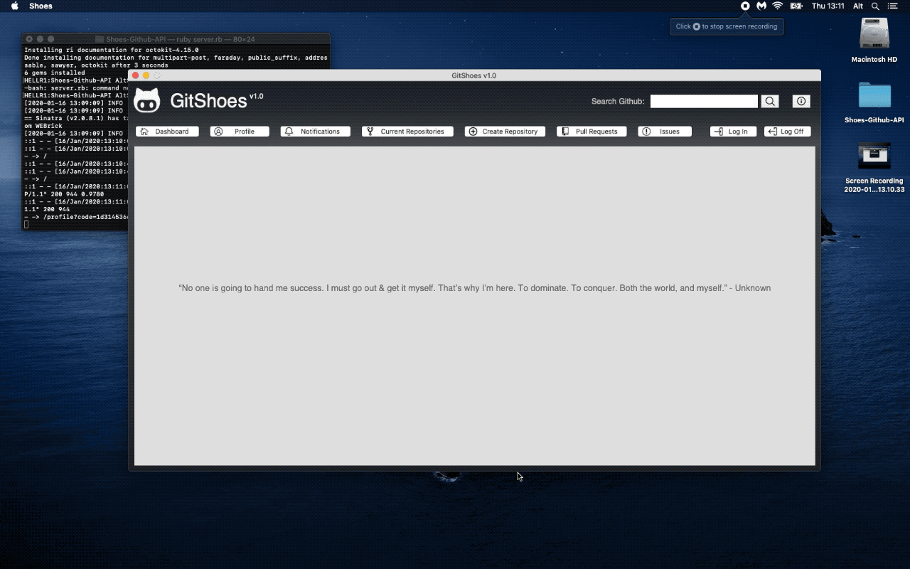

  

  <h1 align="center"> 👟 Gitshoes - A Native Github Tool</h1>

  

    The Capstone project for Microvere's Ruby module
     
    <a href="https://github.com/Rhelli/Shoes-Github-API/tree/feature/readme"><strong>Explore This Repository »</strong></a>
     
     
    <a href="https://github.com/Rhelli/Shoes-Github-API/archive/feature/readme.zip">Download Gitshoes v0.1</a>
    |
    <a href="https://github.com/Rhelli/Shoes-Github-API/issues">Report A Bug</a>
    |
    <a href="https://github.com/Rhelli/Shoes-Github-API/fork">Fork It</a>
  

## Table of Contents
  - [About Gitshoes](https://github.com/queeksm/Tic-Tac-Toe/tree/game_instructions#-about-this-project)
    - [What Is It?](https://github.com/queeksm/Tic-Tac-Toe/tree/game_instructions#-the-project-brief)
    - [Why Is It?](https://github.com/queeksm/Tic-Tac-Toe/tree/game_instructions#-technologies--languages-used)
    - [Current State & Limitations](https://github.com/queeksm/Tic-Tac-Toe/tree/game_instructions#-technologies--languages-used)
  - [Showcase](https://github.com/queeksm/Tic-Tac-Toe/tree/game_instructions#-how-to-play)
  - [The Nitty-Gritty](https://github.com/queeksm/Tic-Tac-Toe/tree/game_instructions#-how-to-play)
    - [Languages & Technologies](#requirements)
    - [Ruby Gems](#setup)
  - [How to Use Gitshoes](#lets-play)
    - [Requirements](#lets-play)
    - [Setup](#lets-play)
    - [Running Gitshoes](#lets-play)
  - [Final Thoughts & Futures]()
  - [Contributions, Issues and Forking](https://github.com/queeksm/Tic-Tac-Toe/tree/game_instructions#-contributions-issues-and-forking)
  - [Creator](https://github.com/queeksm/Tic-Tac-Toe/tree/game_instructions#--creators)
  - [Show Your Support!](https://github.com/queeksm/Tic-Tac-Toe/tree/game_instructions#-show-your-support)
  - [Licensing](https://github.com/queeksm/Tic-Tac-Toe/tree/game_instructions#%EF%B8%8F-licensing)

## 🧭 About Gitshoes

This is the final project in the Ruby module to be completed by students of [Microverse](https://www.microverse.org/ 'The Global School for Remote Software Developers!'). However, as this is the Capstone project for the section, some special rules apply:
 - The project is to be completed individually
 - A 72 hour deadline is issued upon receipt of the project specifications
 
The purpose of these specifications is to mimic real world deadlines and job specifications and test our resolve.

### 🤷🏽‍♂️ What Is It?
Gitshoes is a native desktop tool for using Github. At it's very core, Gitshoes is coded in Ruby, using the [Shoes3]('https://github.com/shoes/shoes3') GUI library and Github's very own API. The Shoes3 GUI library is written in C and then compiled into Ruby, however when it comes to the use of Shoes in this project, all code was written in Ruby. Current (v0.1) functionality available to those using Gitshoes are as follows:
  - Search Github
  - Recieve randomised, daily quotes on the start-up screen
  - An information screen informing the user about the program
  - A login screen which launches an OAuth request for the users Github credentials in browser.

### ⁉️ Why Is It?
It goes without saying that Github is an integral part of all of our lives as developers - there's not a day that goes by where we are working on a project and aren't making frequent commits, searching Github's code database, creating new repositories, reviewing pull requests...the list goes on.

For those of us who like to always have a Github page open in our browser, alongside ~100 other tabs, it can often get a little confusing or vague as to exactly where, amongst those 100 tabs you placed Github. That's where Gitshoes comes in.

As a native application, Gitshoes seperates itself from your browser, making it easier to compartmentalise your Github experience (so to speak).

### 🚦 Current State & Limitations
As of Gitshoes v0.1, there are a number of functions that exist, however there is an even longer list of function to **yet** be implemented. As this is a work in progress, the following fucntionality is planned for release at a future date:
 - Import and view all of your dashboard, profile, existing repository, pull request and issue data and view that data inside Gitshoes.
 - Implement an in-app search function versus redirecting to the broswer
 - Greater cross-platform compatiblity between 32-bit and 64-bit systems.

******

## 🎞️ Showcase

### Authentication & JSON Data

> Logging in with Gitshoes - Either get directed to the 'Create an Account' page or get directed to the Github Login, where the app is authorised via OAuth.

### Searching Github

> Gitshoes uses 'Launchy' to search Github's code base

### The Information Window

> A brief information screen detailing the what's and why's of Gitshoes.

********

## 🎯 The Nitty-Gritty

### Languages & Technologies
 - HTML5
 - CSS3
 - Ruby 2.6.5
 - [Shoes 3.3.1 GUI Library](https://github.com/shoes/shoes3)
 - RSpec 3.9
 - Rubocop 0.79.0
 - Stickler-CI
 - [Github API v3](https://developer.github.com/v3/)

 ### Ruby Gems
 - [Sinatra](https://rubygems.org/gems/sinatra) - Networking and Web server
 - [DotEnv](https://rubygems.org/gems/dotenv) - Loading environment variables
 - [Rest-Client](https://rubygems.org/gems/rest-client) - OAuth authentication with Github's API
 - [JSON](https://rubygems.org/gems/json) - Parsing Github's API responses into JSON format
 - [Octokit](https://rubygems.org/gems/octokit) - Retrieval of user data following OAuth authentication carried out by rest-client
 - [Shoes](https://rubygems.org/gems/shoes) - GUI library
 - [Quotable](https://rubygems.org/gems/quotable) - Randomised quotes for home screen
 - [Launchy](https://rubygems.org/gems/launchy) - Lauching user Github code search requests within browser

## 👾 How To Use Gitshoes
### Requirements
1. You must have Ruby installed on your system. If you do not, please follow Ruby's ['Installing Guide'](https://www.ruby-lang.org/en/documentation/installation/) to get your system set up.

2. You must [install Shoes3](http://shoesrb.com/downloads/) to open the Gitshoes.
> Make a note of the path (where you placed) of the application. You will need it to install the RubyGems later.

3. Download [this repository](https://github.com/Rhelli/Shoes-Github-API/archive/master.zip)

> N.B. For OSX Users - I'd strongly recommend ensuring you properly setup your environment prior to trying to use Ruby or RubyGems. 1. Ensure you have [Homebrew installed](https://brew.sh/) - that will make installing packages easier in the future. 2. Make sure you have [rbenv](https://github.com/rbenv/rbenv) installed (or RVM), otherwise you will be denied permission to install RubyGems to your own machine.

### Setup
1. Ensure you have the RubyGems needed for the application installed on your machine. To install them, enter the following into your        terminal:
    - Install bundler:

            `gem install bundler`

    - Install the needed Gems for Gitshoes. Enter the following into your terminal (this is gloabl, **not** just the repository):

            `bundle install`

   Your terminal should now install the following RubyGems: sinatra, octokit, rest-client, launchy, dotenv, json, shoes, quotable and  launchy (along with their [dependencies](https://guides.rubygems.org/patterns/#declaring-dependencies)).

2. Shoes handles it's own Gems, seperate from your system, so we must now duplicate step 2, **however** this time we are going to           install the gems **specifically into the Shoes app.**
    - **Mac OSX** - Ensure the Shoes app you downloaded is in your application folder and enter the following into your terminal (ignore the 'deprecated' message):
    
            `bundle install --path /Applications/Shoes.app/Contents/MacOS/lib/ruby/gems/2.3.0`
    
    - **Windows** - Ensure Shoes installed correctly to your 'Program Files(x86)' folder and then enter the following into your terminal(ignore the 'deprecated' message):
    
            `bundle install --path "C:\Program Files (x86)\Shoes\lib\ruby\gems\2.3.0"
    
    - **Linux** - Ensure Shoes installed (depending on distro) to 'usr/local/bin' and then enter the following into your terminal(ignore the 'deprecated' message):
    
            `bundle install --path "usr/local/bin/Shoes/lib/ruby/gems/2.3.0"

### Running Gitshoes
1. Open your terminal. `cd` into the Gitshoes repository and run the following command to start the server:

        `ruby server.rb`

2. Open the Gitshoes app and select 'Run an App'. Then select 'app.rb' from inside the 'lib' folder inside the Gitshoes repository (Shoes-Github-API/lib/app.rb).

You're good to go!

*********

## 🥂 Contributions, Issues and Forking

Contributions, issues and feature requests are more than welcome! 

If you have any problems running or setting up Gitshoes, please submit it as a bug on the [issues page.](https://github.com/Rhelli/Shoes-Github-API/issues) right away!

If you want to make your own changes, modifications or improvements, go ahead and Fork it!
1. Fork it (https://github.com/queeksm/Tic-Tac-Toe/fork)
2. Create your working branch (git checkout -b [choose-a-name])
3. Commit your changes (git commit -am 'what this commit will fix/add/improve')
4. Push to the branch (git push origin [chosen-name])
5. Create a new Pull Request

## 🔮 Final Thoughts & Futures
Gitshoes is in it's infancy, and as such, it is lacking in the full suite of features that are first apparent to the user. However, as development progresses, I'd like to add the obvious features (such as making all the buttons fully functional) as well as a few others such as:

  **Login:**
  - Transfer OAuth to OAuth2 in complicance with Github's authentication standards
  - Allow for entirely in-app login
  - Login screen opens first before main window
  - Implementation of a 'Remember Me' feature to prevent having to log in every time the app is opened

  **Search:**
  - Simple radio/switch control for Google or Github Search

 **Functionality:**
  - Create Pull Requests
  - Create Issue
  - Profile Acitibity Statistics & Graphs
  
  **Thematic:**
  - Simple radio/switch control for day/night mode

## 👨🏽‍💻 Creator

Rory Hellier - [Github](https://github.com/Rhelli)

## 🖐🏼 Show Your Support!

Give a ⭐️ if you like this project!

## 🎩 Acknowledgements
 - Shoes3 for providing the GUI library
 - Github for their API

## 📚 Noteable Resources
  - [Shoes3 Manual](http://shoesrb.com/manual/Hello.html) - Starting with Shoes
  - [Shoes3 Wiki](https://github.com/shoes/shoes3/wiki) - Advanced Use of Shoes
  - [OAuth-Ruby-Quickstart](https://github.com/githubOAuth-Ruby-Quickstart) - An excellent guide to getting simple OAuth authentication started using Sinatra, rest-client and Octokit

## ⚖️ Licensing
This project is [MIT](https://github.com/queeksm/Tic-Tac-Toe/LICENSE.txt) licensed.
